JuWavelet Documentation
------------------------

This document collects the examples and their output in one document.
The functions generating these images are located in the examples folder.

decompose1d.py
=========================

This example analyses a 1-D signal with 4 different methods to showcase the similarities and differences.

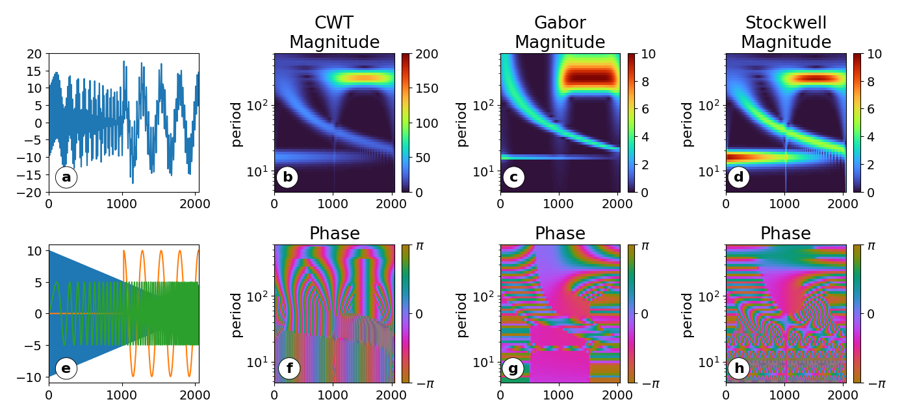

.. include:: ../examples/decompose1d.py
   :code: python

decompose2d.py
=========================

This example analyses ALIMA temperature data and show the full decomposition in figure (a) and some reconstruction examples in figure (b).

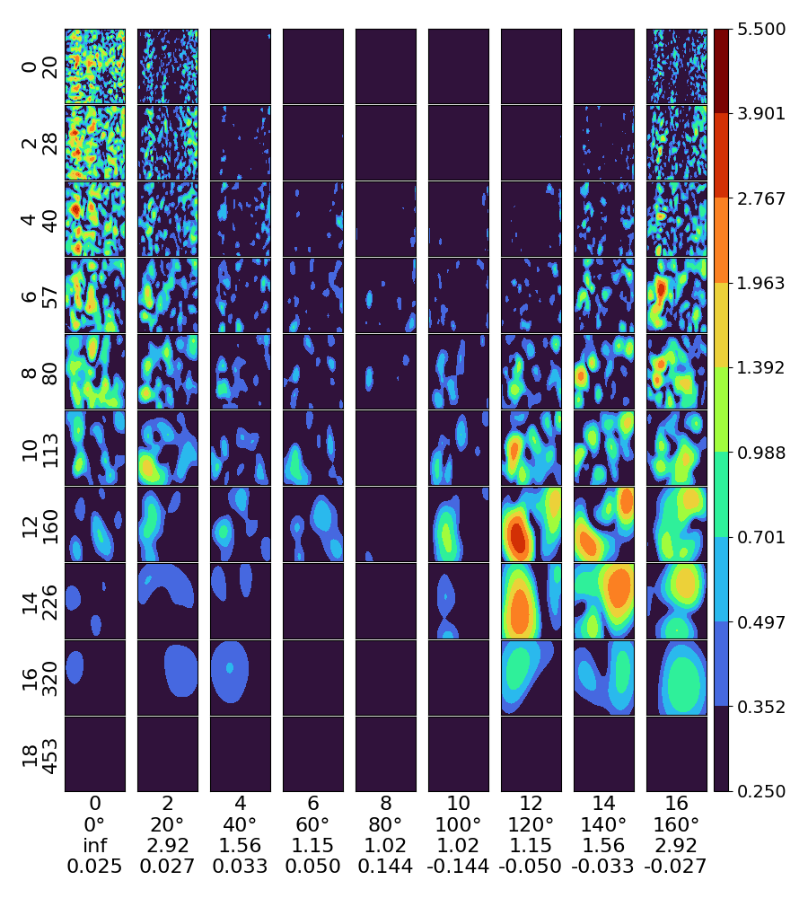

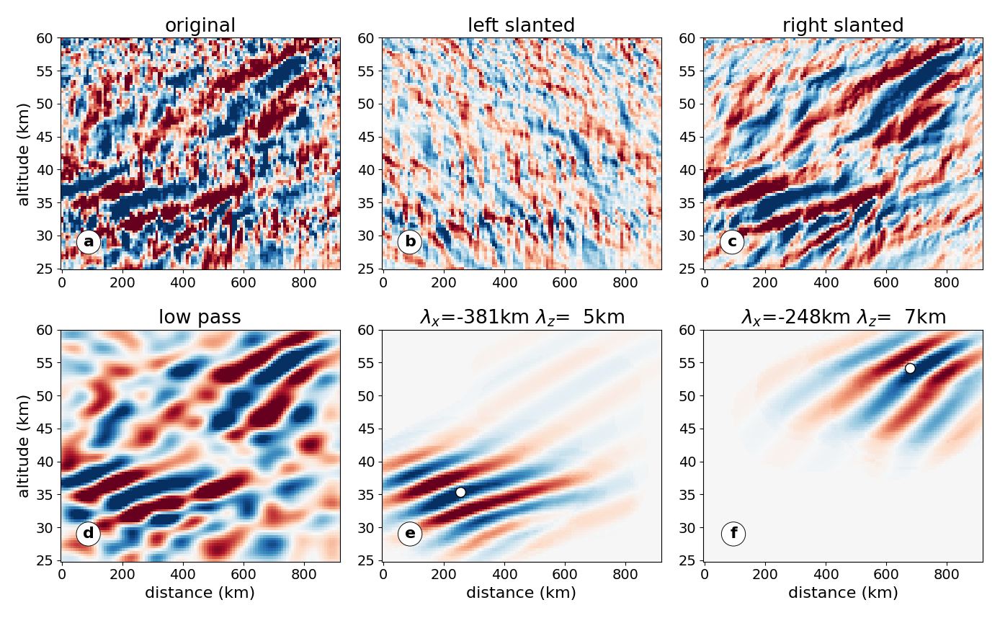

.. include:: ../examples/decompose2d.py
   :code: python

identify_clusters.py
=========================

This cluster uses the ALIMA example to show how the (very simple)
cluster identification algorithm works.

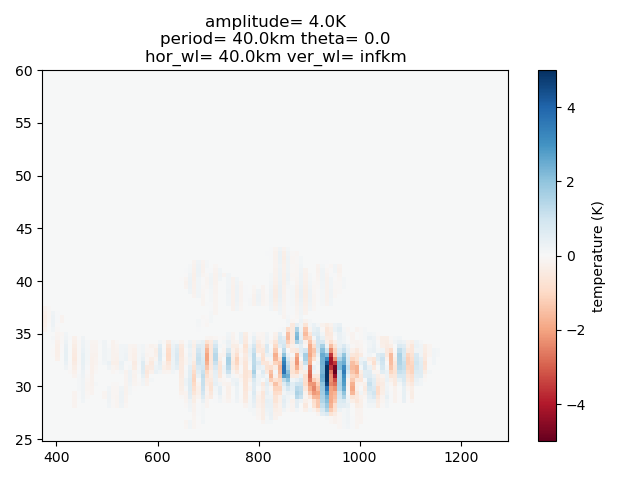

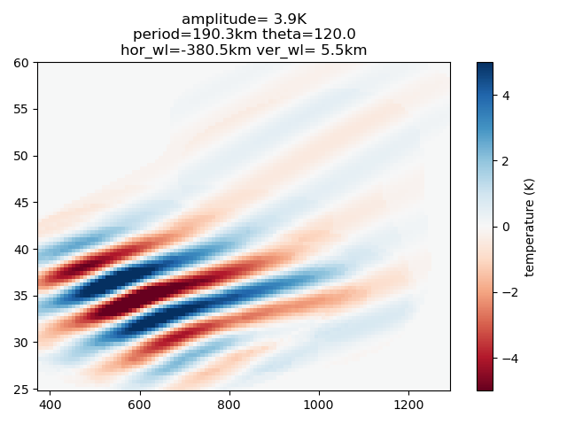

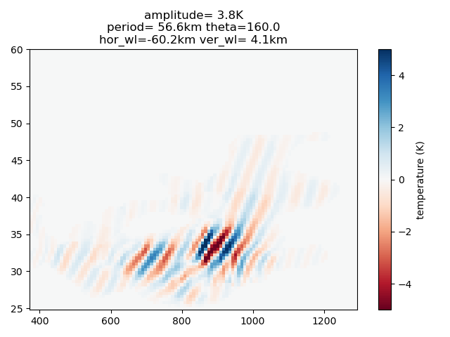

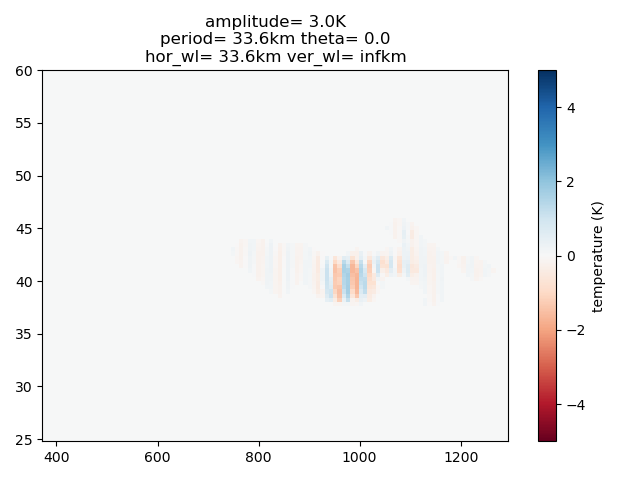

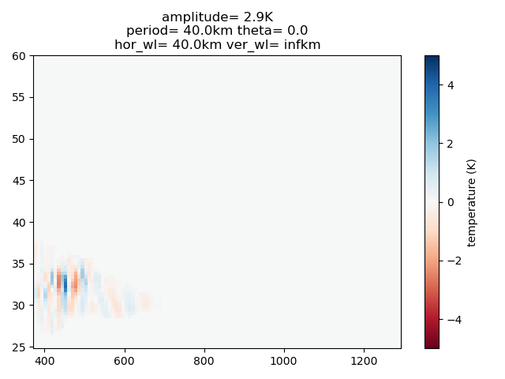

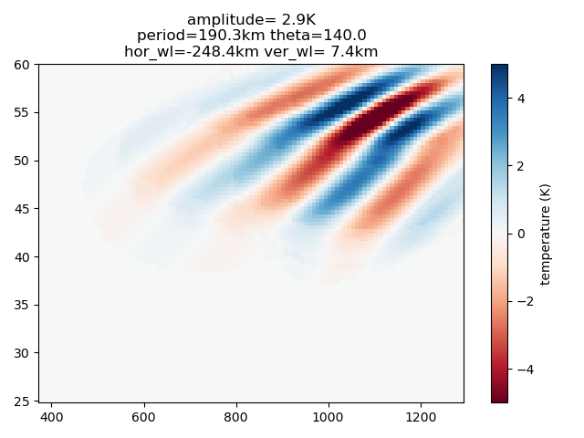

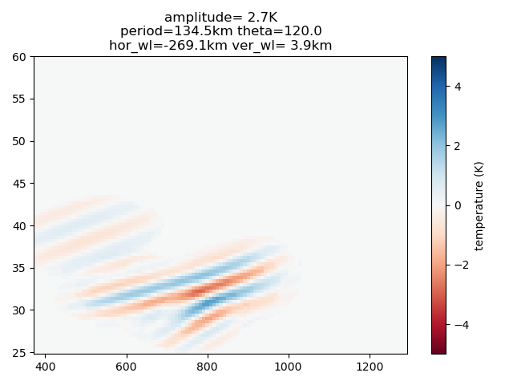

.. image:: images/identify_clusters/example_cluster_11.png

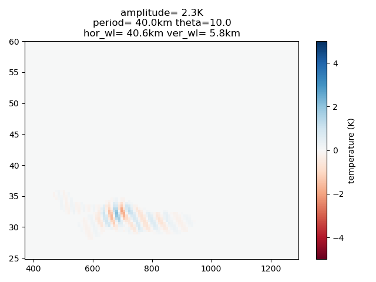

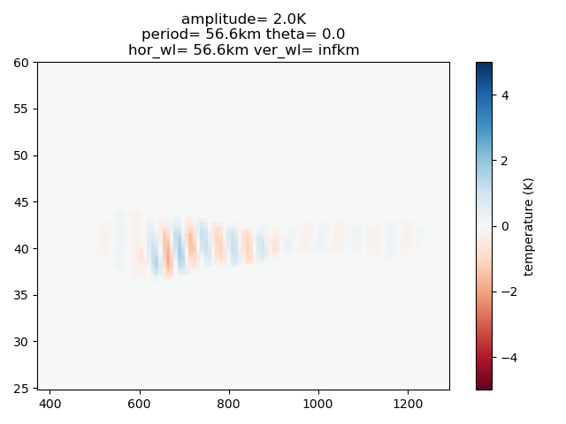

.. include:: ../examples/identify_clusters.py
   :code: python

separate2d.py
=========================

This example shows how an artificial 2-D signal composed of
8 different signals can be analysed using the 2-D decomposition.

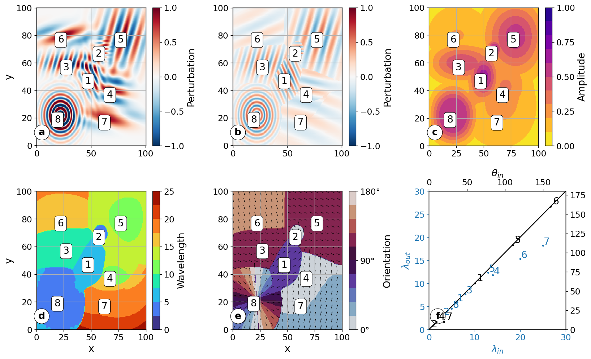

.. include:: ../examples/separate2d.py
   :code: python

sst.py
=========================

This example recreates the SST analysis figure from Torrence and Compo (1998).

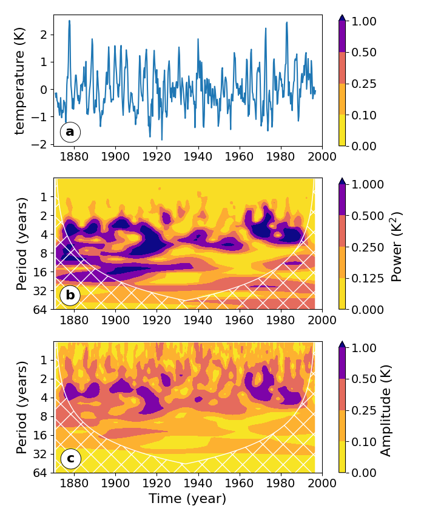

.. include:: ../examples/sst.py
   :code: python

stft.py
=========================

These figures show real and Fourier space representation of
1-D Morlet wavelet and Heisenberg basis functions to showcase
similarities and differences between the CWT and STFT approaches.

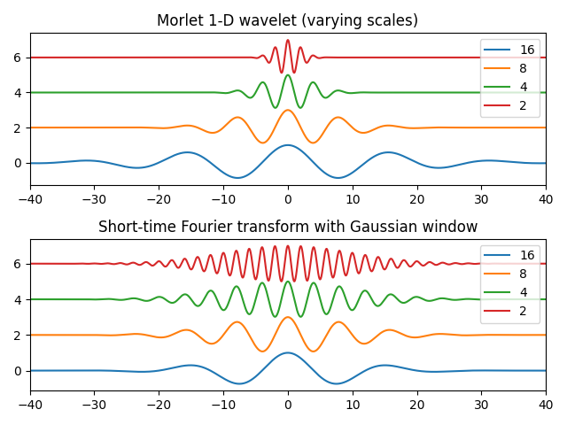

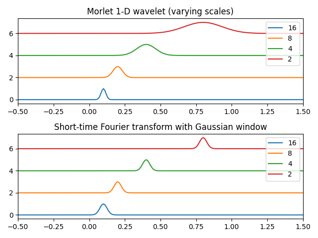

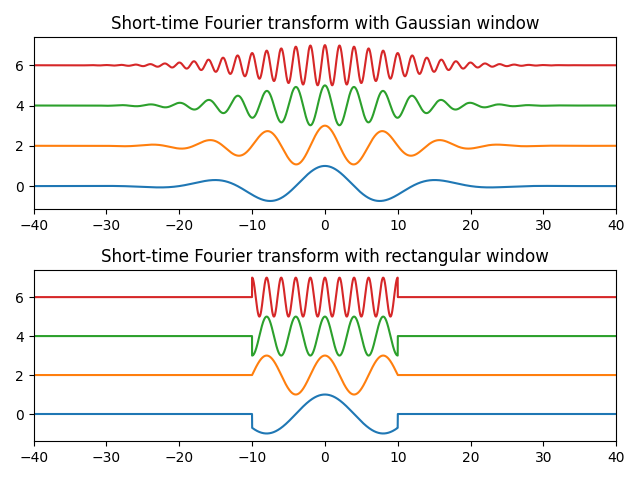

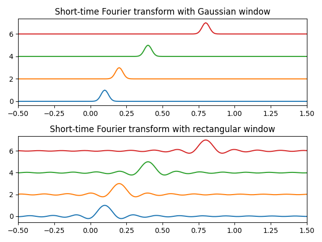

.. include:: ../examples/stft.py
   :code: python

tapering.py
=========================

This shows the implemented tapering functions, which should be
used if the boundary of the analysed data is not close to zero.

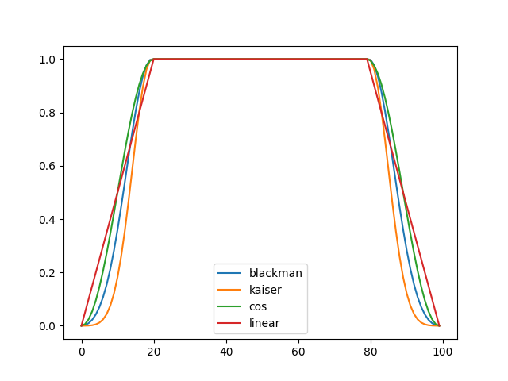

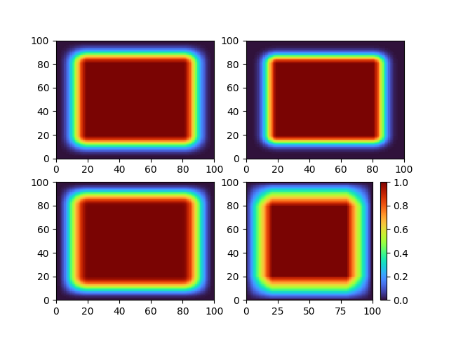

.. include:: ../examples/tapering.py
   :code: python

wavelet1d.py
=========================

This plots the 1-D Morlet wavelet.

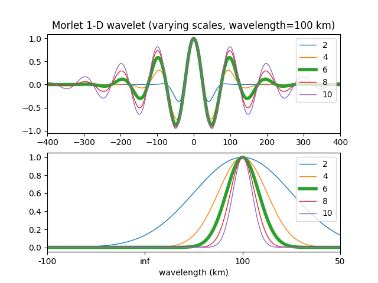

.. include:: ../examples/wavelet1d.py
   :code: python

wavelet2d.py
=========================

This plots the 2-D Morlet wavelet.

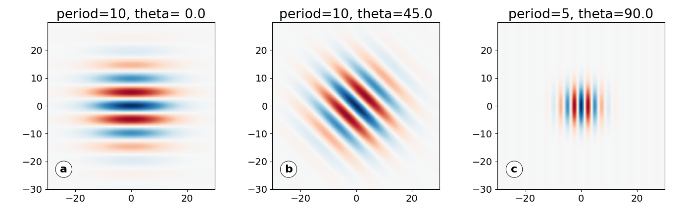

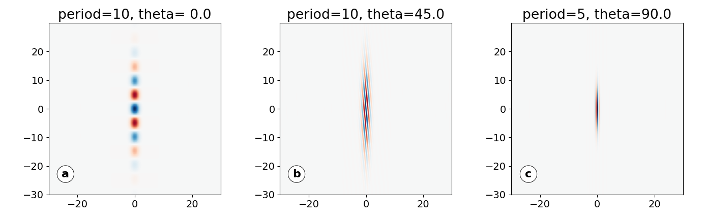

.. include:: ../examples/wavelet2d.py
   :code: python

